<!-- markdownlint-disable MD041 -->
<p align="center">
  <a href="https://invariantsystems.io">
    
  </a>
</p>

# AIIR — AI Integrity Receipts

**The missing provenance layer for AI-assisted code.**

Your team uses AI to write code. Six months from now, someone will ask: *which parts of this codebase were AI-generated, and can you prove it?*

AIIR answers that. It generates deterministic, content-addressed receipts for commits with declared AI involvement, then verifies them anywhere — locally, in CI, or offline — with no central service to trust. Plain JSON, zero dependencies, Apache 2.0.

> **Scope:** AIIR records *declared* AI involvement and verifies receipt integrity; it does not detect hidden or undeclared AI use ([details](docs/integrations/ecosystem.md#what-aiir-does-not-do)). And yes, like the tool, these docs are openly AI-assisted.

[](https://pypi.org/project/aiir/)
[](https://github.com/invariant-systems-ai/aiir/actions/workflows/ci.yml)
[](https://opensource.org/licenses/Apache-2.0)
[](https://github.com/invariant-systems-ai/aiir)
[](https://invariantsystems.io)
[](https://github.com/marketplace/actions/aiir-ai-integrity-receipts)
[](https://gitlab.com/explore/catalog/invariant-systems/aiir)
[](https://scorecard.dev/viewer/?uri=github.com/invariant-systems-ai/aiir)
[](https://github.com/invariant-systems-ai/aiir/stargazers)

<p align="center">
  
</p>

---

## Install → Generate → Verify

```bash
pip install aiir              # Python 3.9+, zero dependencies
cd your-repo
aiir --pretty                 # receipt your last commit
aiir --verify .aiir/receipts.jsonl   # verify nothing was tampered with
```

That's it. Your last commit now has a content-addressed receipt in `.aiir/receipts.jsonl`. Run it again on the same commit: same receipt, zero duplicates. Add CI and signing later only if you need stronger release evidence.

### What just happened?

```text
┌─ Receipt: g1-a3f8b2c1d4e5f6a7...
│  Commit:  c4dec85630
│  Author:  Jane Dev <jane@example.com>
│  Files:   4 changed
│  AI:      YES (copilot)
│  Hash:    sha256:7f3a8b...
└──────────────────────────────────────
```

AIIR read your commit metadata, canonicalized the declared AI context, and produced a **content-addressed receipt**. Change one byte in the receipt core and verification fails. That's the tamper-evidence.

Without signing, a receipt proves **integrity** (nothing was altered). Add Sigstore signing in CI for **authenticity** (proving *who* generated it). Verification does not require trusting AIIR or a hosted service: receipts are plain JSON and can be checked anywhere a verifier runs. See [Verify AIIR independently](docs/reference/verify-independently.md).

For the shortest anomaly instead of the full product tour, start with [examples/verify-pass-strict-fail/](examples/verify-pass-strict-fail): the same receipt verifies cleanly in both directories, but the unsigned directory still fails `--policy strict` until the matching `.sigstore` sidecar is present.

---

## How it works

AIIR records what is **declared** in commit metadata, generates a deterministic receipt over that declaration, and lets anyone verify it later. The receipt is **content-addressed**: `receipt_id` is derived from the SHA-256 of the canonical JSON, so changing any field changes the hash and invalidates the receipt. That single property is the whole trust story — tamper-evidence without a server.

Detection signals (`Co-authored-by: Copilot`, bot authors, `Assisted-by:`/`Generated-by:` trailers, 48 known AI-tool signals, Unicode evasion handling) are optional *enrichment*: they normalize and classify the declared context, but they are not authoritative proof of hidden AI usage. AIIR does not claim to detect every undeclared use of Copilot, ChatGPT, Claude, Cursor, or any other tool — inline completions, copy-paste, agent-mode chat sessions, and squash merges that strip trailers leave no durable signal. Closing that declaration gap is exactly the wedge the [agent-receipt profile](docs/integrations/agent-receipt-contract.md) addresses.

You could track AI involvement with `Co-authored-by` trailers or ADRs, and AIIR is compatible with that. Trailers are the baseline; AIIR makes that baseline machine-verifiable, consistent across CLI/editor/CI/assistants, and optionally signable. See [THREAT_MODEL.md](THREAT_MODEL.md) for the full STRIDE/DREAD analysis.

---

## Where AIIR fits in the supply chain

AIIR fills a specific gap alongside SLSA, in-toto, and SCITT: **authorship-level provenance**, recording *who or what* produced a code change, before it enters the build pipeline.

| System | Layer | What it proves | Where AIIR fits |
|--------|-------|---------------|-----------------|
| [SLSA](https://slsa.dev) | Build provenance | *How* an artifact was built, from which source | AIIR receipts feed SLSA as source-level attestations |
| [in-toto](https://in-toto.io) | Supply chain attestation | That each step in a layout was performed correctly | AIIR wraps receipts as in-toto Statements (`--in-toto`) |
| [SCITT](https://scitt.io) | Transparency ledger | That a claim was registered in a tamper-evident log | AIIR receipts are valid SCITT claims (content-addressed, signable) |
| [Sigstore](https://sigstore.dev) | Signing infrastructure | *Who* signed an artifact (identity binding) | AIIR uses Sigstore for receipt signing (`--sign`) |
| [OpenSSF Scorecard](https://scorecard.dev) | Project health | Security posture of an OSS project | Orthogonal: AIIR tracks per-commit AI provenance, not project posture |
| Git trailers | Commit metadata | Free-text annotation | AIIR makes trailers machine-verifiable and tamper-evident |

Git records *that* a change happened. SLSA records *how* the artifact was built. AIIR records *what* produced the change (human, AI-assisted, or bot) with a verifiable receipt.

For public adapter notes that fit AIIR into existing attestation, graph, and policy ecosystems without overclaiming standards status, see [docs/integrations/ecosystem.md](docs/integrations/ecosystem.md) and the public hub at <https://invariantsystems.io/ecosystem/>. Repo-local adapter notes are available for [GUAC](contrib/guac/README.md), [Witness](contrib/witness/README.md), and [AMPEL policy](contrib/ampel/README.md). AIIR can also emit a generic [commitment receipt](docs/reference/commitment-receipts.md) over files, directories, or declared digests for non-commit artifacts.

---

## CI/CD

GitHub Actions and GitLab CI are the primary CI path, each a one-liner with signing on by default:

```yaml
# GitHub Actions — one line (signing on by default)
- uses: invariant-systems-ai/aiir@v1
  with:
    output-dir: .receipts/
```

```yaml
# GitLab CI/CD Catalog — one line
include:
  - component: gitlab.com/invariant-systems/aiir/receipt@1
```

For the full GitHub Action (inputs, outputs, PR integration), GitLab CI/CD Catalog inputs, Sigstore signing, and recipes for Docker, Bitbucket, Azure DevOps, CircleCI, Jenkins, and pre-commit, see [docs/integrations/ci-platforms.md](docs/integrations/ci-platforms.md).

For AI assistants, the MCP server (`aiir-mcp-server --stdio`) works with Claude, Copilot, Cursor, Continue, Cline, and Windsurf so your assistant generates receipts automatically after writing code — see [MCP setup](docs/reference/mcp.md).

---

## Trust tiers

| Tier | What you get | Use when |
|------|-------------|----------|
| **Unsigned** (`sign: false`) | Tamper-evident: hash integrity detects modification | Local dev, internal audit trails |
| **Signed** (`sign: true`, default in CI) | Authenticity: Sigstore binds the receipt to an OIDC identity | CI/CD compliance, SOC 2 evidence |
| **Enveloped** (`--in-toto --sign`) | Signed + in-toto Statement v1 envelope | SLSA provenance; designed to support use as evidence under frameworks like the EU AI Act |

These are the three tiers currently reachable by any user of this tool. [SPEC.md](SPEC.md) documents a detailed Tier 1/2/3 breakdown that maps to the same three levels. "Inference-Bound" (model-output hash chain) is a planned future tier documented in the [agent-receipt profile draft](docs/integrations/agent-receipt-contract.md), not yet available in the CLI.

The verification pipeline runs `git commit → AIIR receipt → Sigstore signing → Policy evaluation → VSA → CI gate`. Developers add `aiir` to CI for a pass/fail check; security teams get policy-evaluated results as signed attestations; auditors query the JSONL ledger, where every claim is cryptographically verifiable.

---

## Documentation

Start at the [documentation index](docs/README.md). The most-used entry points:

| Doc | For |
|-----|-----|
| [CLI reference](docs/reference/cli.md) | Every command, flag, and exit code in one place |
| [Solo developer](docs/guides/guide-solo-developer.md) | Local receipting, pre-commit hook, no CI needed |
| [OSS maintainer](docs/guides/guide-oss-maintainer.md) | Signed CI receipts, policy gates, contributor guidelines |
| [Security team](docs/guides/guide-security-team.md) | Independent verification, trust tiers, compliance integration |
| [CI platforms](docs/integrations/ci-platforms.md) | Docker, Bitbucket, Azure, CircleCI, Jenkins, pre-commit |
| [GitLens integration](docs/integrations/gitlens-integration.md) | AI commit composition + verifiable AIIR provenance |
| [Verify AIIR independently](docs/reference/verify-independently.md) | Check receipts without trusting AIIR, using only standard tools |
| [Release evidence bundles](docs/guides/release-bundles.md) | Hand an auditor a self-contained, offline-verifiable evidence packet |
| [Operator model](docs/reference/operator-model.md) | What can fail? What blocks it? What do I do next? |

The [AIIR extension](https://marketplace.visualstudio.com/items?itemName=invariant-systems.aiir) for VS Code adds editor-side inspection and local receipt workflows as an optional convenience layer.

### Reference

Short pointers into the deeper material; each links the authoritative doc rather than restating its tables.

- **Detection signals** — declared AI assistance, bot/automation authors, and TR39 homoglyph/NFKC handling. Bot and AI signals are fully separated (a Dependabot commit is `authorship_class: "bot"`, not AI). See [THREAT_MODEL.md](THREAT_MODEL.md) and [docs/integrations/ecosystem.md](docs/integrations/ecosystem.md).
- **Receipt format & content-addressing** — `receipt_id` is the SHA-256 of the canonical JSON; the `provenance.repository` field is part of the hash, so the same commit yields a different `receipt_id` if the remote URL changes. See [SPEC.md](SPEC.md) and [docs/reference/tamper-detection.md](docs/reference/tamper-detection.md).
- **Ledger (`.aiir/`)** — append-only `receipts.jsonl` plus an auto-maintained `index.json`; one directory to commit, auto-deduplicated, queryable with `jq`/`grep`/`wc -l`. See the [CLI reference](docs/reference/cli.md#output-modes).
- **Policy engine & release VSA** — `strict`/`balanced`/`permissive` presets, customizable via `.aiir/policy.json`; `aiir --verify-release --emit-vsa` emits an in-toto [Verification Summary Attestation](https://slsa.dev/verification_summary). See the [CLI reference](docs/reference/cli.md#policy-engine).
- **MCP server** — seven tools (`aiir_receipt`, `aiir_verify`, `aiir_stats`, `aiir_explain`, `aiir_policy_check`, `aiir_verify_release`, `aiir_gitlab_summary`) over stdio; config snippets for Claude Desktop, VS Code/Copilot, Cursor, Continue, Cline, and Windsurf in the [MCP setup guide](docs/reference/mcp.md).
- **Agent attestation & agent receipts** — `--agent-tool`/`--agent-model`/`--agent-context` attach allowlisted metadata in `extensions.agent_attestation`; `aiir agent emit`/`aiir agent verify` record a finer-grained agent *action* (read/edit/run/…) so provenance survives even when the commit leaves no trailer. See [docs/integrations/agent-receipt-contract.md](docs/integrations/agent-receipt-contract.md#using-it-first-party-implementation).

---

## Proof points

Everything here is verifiable: public artifacts you can audit yourself, not testimonials behind a login.

| Proof | What it proves | Verify it |
|-------|---------------|-----------|
| **This repo receipts itself** | Dogfood: every push to `main` runs AIIR and publishes signed receipts to the public `receipts` branch | [receipts branch](https://github.com/invariant-systems-ai/aiir/tree/receipts), [dogfood workflow](https://github.com/invariant-systems-ai/aiir/actions/workflows/dogfood.yml) |
| **100% test coverage (see CI for current count)** | Every release passes Python 3.9–3.13 × Ubuntu/macOS/Windows | [CI runs](https://github.com/invariant-systems-ai/aiir/actions/workflows/ci.yml) |
| **101 stable commit-receipt conformance test vectors** | Third-party implementors can verify stable hashing, adversarial handling, Unicode evasion, canonicalization, and v2 DAG-binding for the AIIR commit-receipt spec | [schemas/test_vectors.json](schemas/test_vectors.json), [conformance-manifest.json](schemas/conformance-manifest.json) |
| **3 agent-receipt v0.1 draft vectors** | Verify the agent-action receipt profile (`a1-` ids) byte-for-byte against the published draft vectors | [schemas/test-vectors/agent_receipt_vectors.v0.1.json](schemas/test-vectors/agent_receipt_vectors.v0.1.json) |
| **150+ documented security controls** | Per-element STRIDE analysis, DREAD risk scoring, and attack trees, published in full | [THREAT_MODEL.md](THREAT_MODEL.md) |
| **Release evidence on every release** | PyPI artifacts, GitHub provenance bundles, the release SBOM, and a Rekor-backed release manifest are bound into a public verification surface | `python scripts/verify-release-evidence.py 1.7.0` |
| **Zero runtime dependencies** | Nothing to compromise | `pip install aiir && pip show aiir` |
| **Browser verifier** | Client-side receipt verification, no upload, no account | [invariantsystems.io/verify](https://invariantsystems.io/verify) |

See [docs/case-studies/aiir-self-dogfood.md](docs/case-studies/aiir-self-dogfood.md) for the public dogfood walkthrough behind the first row.

---

## Show AIIR in your README

Add a transparency badge so reviewers and auditors know your project receipts AI involvement:

```bash
aiir --badge        # auto-generates Markdown with your repo's AI %
```

Or copy a static badge:

```markdown
[](https://github.com/invariant-systems-ai/aiir)
```

Preview: [](https://github.com/invariant-systems-ai/aiir)

The `--badge` variant reads your ledger and shows the actual AI-assisted percentage. The static badge signals adoption without revealing stats.

---

## Specification & schemas

The normative format lives in [SPEC.md](SPEC.md) (canonical JSON, content addressing, verification), with change control in [SPEC_GOVERNANCE.md](SPEC_GOVERNANCE.md). JSON Schemas and test vectors are under [schemas/](schemas/) — including [commit_receipt.v2.schema.json](schemas/commit_receipt.v2.schema.json), [agent_receipt_contract.v0.1.schema.json](schemas/agent_receipt_contract.v0.1.schema.json), the [stable conformance vectors](schemas/test_vectors.json), and the [VSA predicate schema](schemas/verification_summary.v1.schema.json). See the [documentation index](docs/README.md) for SDKs, the threat model, and the stability contract.

---

## Project status

Maintained, roadmap demand-led (last reviewed 2026-06-06). The core CLI, receipt format, verification path, and CI templates are supported for bug fixes, security fixes, compatibility updates, and small docs improvements. New roadmap work is demand-led: larger surfaces need a real user, a design partner, or a co-maintainer to help own them. We are especially keen on co-maintainers for CI examples, schema/conformance fixtures, threat-model review, editor/MCP adapters, and pilot feedback. See [CONTRIBUTING.md](CONTRIBUTING.md).

## About

Built by [Invariant Systems, Inc.](https://invariantsystems.io). Apache-2.0.

**Citing**: Use the **Cite this repository** button on GitHub or see [CITATION.cff](CITATION.cff).

**Trademarks**: "AIIR", "AI Integrity Receipts", and "Invariant Systems" are trademarks of Invariant Systems, Inc. See [TRADEMARK.md](TRADEMARK.md).

**Signed releases**: Every PyPI release uses [Trusted Publishers](https://docs.pypi.org/trusted-publishers/) (OIDC), with no static API tokens. Each release is tied to a specific GitHub Actions run, commit SHA, and workflow file.

## Privacy

This Action contacts Chainguard's licensing server to verify authorization. Connection metadata (IP address, GitHub repository identifier, timestamp, and any metadata encoded in the auth token) is transmitted to Chainguard, Inc. even if authorization is denied in accordance with our [Privacy Notice](https://www.chainguard.dev/legal/privacy-notice)
